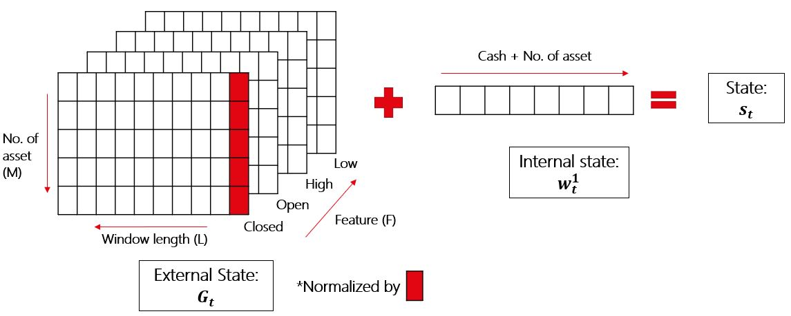
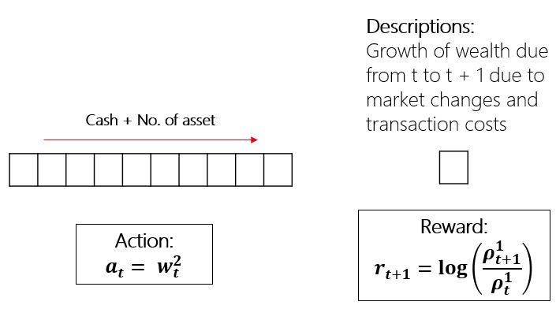
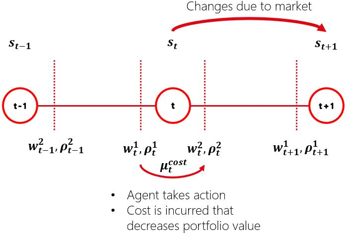

# Vanilla-Deterministic-Policy-Gradient-For-Portfolio-Management

An attempt to use direct Policy Gradient approach on portfolio management.

Provided are:

1) Data from 3 geographical regions Singapore, US, China

2) Simulated Environment from the data

3) Agents include: DPG, Uniformly Constant Rebalancing Portfolio (UCRP) and the out-of-sample Minimum Variance Optimisation

4) Misc: Some data cleaning, visulisation and checking

Results will not be spectacular due to lack of risk control.

